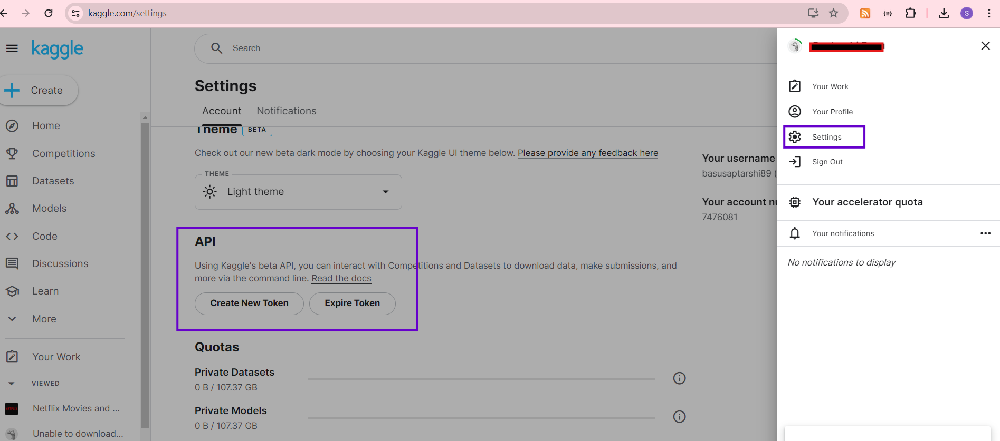

# airflow_duckdb
Sample Airflow DAG with DuckDB for data analysis


## Setup steps

#### Install Astro CLI (Airflow)

I have used astro CLI to setup Airflow server (docker) locally. It is possible to use docker directly to setup Airflow. 
However, astro CLI can help reduce the setup time drastically.

> **NOTE** Please note, docker desktop is a prerequisite to use Astro CLI for setting up local Airflow server.

Please check the documentation for installing Astro CLI - [Install the Astro CLI](https://docs.astronomer.io/astro/cli/install-cli?tab=windowswithwinget#install-the-astro-cli)


#### Get started with Airflow (using Astro CLI)

Documentation - [Get started](https://docs.astronomer.io/astro/cli/get-started-cli)

> **NOTE** You need to have Git installed on your computer to be able to clone the repository.

Setup command (windows):

```cmd


mkdir "C:\Users\<username>\Git"
cd C:\Users\<username>\Git

git clone git@github.com:basusaptarshi89/airflow_duckdb.git

cd airflow_duckdb

astro dev init

copy resources\dags\ dags\
mkdir include\sql
copy resources\include\sql\ include\sql\
copy resources\requirements.txt requirements.txt

astro dev start


```

The last command (astro dev start) should start the docker containers for Airflow server.


#### Setup Kaggle API key

The sample dataset used in this project is downloaded from Kaggle (https://www.kaggle.com/datasets/rahulvyasm/netflix-movies-and-tv-shows). The choice of dataset is completely random. However, if you decide to use a different dataset, please ensure to check the column names and adjust the SQL statements accordingly.


Create your free account on Kaggle (https://www.kaggle.com/) and create API key.

Once you are logged in to the website, on top right corner you will find your profile. Got to settings and generate the API key.



